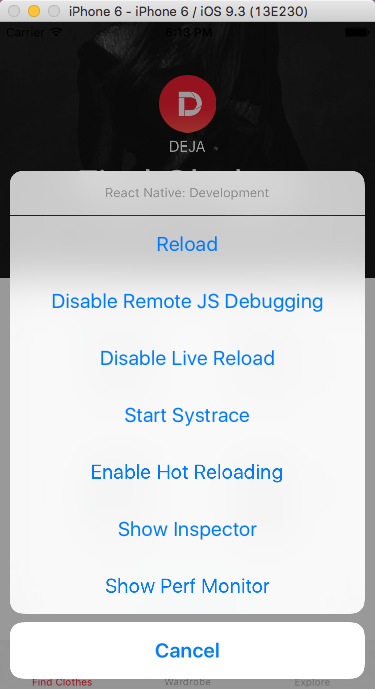

# 1.3 Debug tools

1.[developer menu](https://facebook.github.io/react-native/docs/debugging.html)



2.Chrome Devtools


3.log
```
console.log('some text');
console.dir({a:1, b:2, c:3});
debugger;//breaking point
```
4.[Atom](https://atom.io/) & [nuclide](https://nuclide.io/)


5.inspect


6.[Real device](https://facebook.github.io/react-native/docs/debugging.html#chrome-developer-tools)

6.1 Deploy to real device
`project_name/ios/project_name/AppDelegate.m`

```

  //jsCodeLocation = [NSURL URLWithString:@"http://localhost:8081/index.ios.bundle?platform=ios&dev=true"];

  /**
   * OPTION 2
   * Load from pre-bundled file on disk. The static bundle is automatically
   * generated by the "Bundle React Native code and images" build step when
   * running the project on an actual device or running the project on the
   * simulator in the "Release" build configuration.
   */

   jsCodeLocation = [[NSBundle mainBundle] URLForResource:@"main" withExtension:@"jsbundle"];
```
6.2 Debug in real device

`node_modules/react-native/blob/master/Libraries/WebSocket/RCTWebSocketExecutor.m`
```
  if (!_url) {
    NSUserDefaults *standardDefaults = [NSUserDefaults standardUserDefaults];
    NSInteger port = [standardDefaults integerForKey:@"websocket-executor-port"] ?: 8081;
    //NSString *URLString = [NSString stringWithFormat:@"http://172.28.0.230:%zd/debugger-proxy?role=client", port];
    NSString *URLString = [NSString stringWithFormat:@"http://localhost:%zd/debugger-proxy?role=client", port];
    _url = [RCTConvert NSURL:URLString];
  }
```