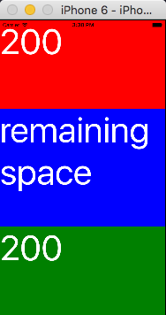

 # 3.1 Flexbox


1.[Flexbox layout](https://css-tricks.com/snippets/css/a-guide-to-flexbox/)
  >The main idea behind the flex layout is to give the container the ability to alter its items' width/height (and order) to best fill the available space (mostly to accommodate to all kind of display devices and screen sizes). A flex container expands items to fill available free space, or shrinks them to prevent overflow.


2.flex:1



 ```
const styles = StyleSheet.create({
  container: {
    flex: 1
  },
  header: {
    height: 200,
    backgroundColor: 'red'
  },
  main: {
    flex: 1,
    backgroundColor: 'blue'
  },
  footer: {
    height: 200,
    backgroundColor: 'green'
  },
  text: {
    color: '#ffffff',
    fontSize: 80
  }
});
 ```
3.flexDirection:'row'|'column' , [Understanding Flex Direction](http://www.standardista.com/understanding-flex-direction/)


4.justifyContent:'flex-start'|'flex-end'|'center'|'space-between'|'space-around';

5.alignItems:'flex-start'|'flex-end'|'center'|'stretch'


[Flex Properties](https://facebook.github.io/react-native/docs/flexbox.html#content)


