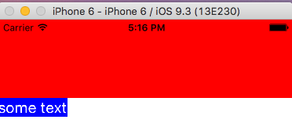

# 3.3 Size & Dimensions & onLayout

1.window size



```
let winSize = Dimensions.get('window');
console.log(winSize);
class Size extends Component {
  render() {
    return (
      <View style={styles.container}>
        <View style={styles.block}/>
        <Text style={styles.text}>some text</Text>
      </View>
    );
  }
}
const styles = StyleSheet.create({
  container: {
    flex: 1,
    alignItems: 'flex-start'
  },
  block: {
    height: 100,
    width: winSize.width,
    backgroundColor: 'red'
  },
  text: {
    color: '#ffffff',
    fontSize: 40/winSize.scale,
    backgroundColor: 'blue'
  }
});
```

2.[onLayout](http://facebook.github.io/react-native/releases/0.28/docs/view.html#onlayout)

```
class Size extends Component {
  handleTextLayout(evt){
    console.log(evt.nativeEvent.layout);
  }
  render() {
    return (
      <View style={styles.container}>
        <View style={styles.block}/>
        <Text style={styles.text}
          onLayout={this.handleTextLayout}>some text</Text>
      </View>
    );
  }
}
```