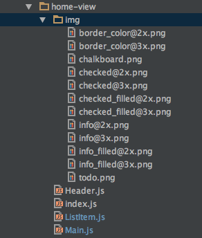

# 4.3 Containers & Components

1.[Presentational and Container Components](http://redux.js.org/docs/basics/UsageWithReact.html)

<table>
    <thead>
        <tr>
            <th></th>
            <th scope="col" style="text-align:left">Presentational Components</th>
            <th scope="col" style="text-align:left">Container Components</th>
        </tr>
    </thead>
    <tbody>
        <tr>
          <th scope="row" style="text-align:right">Purpose</th>
          <td>How things look (markup, styles)</td>
          <td>How things work (data fetching, state updates)</td>
        </tr>
        <tr>
          <th scope="row" style="text-align:right">Aware of Redux</th>
          <td>No</th>
          <td>Yes</th>
        </tr>
        <tr>
          <th scope="row" style="text-align:right">To read data</th>
          <td>Read data from props</td>
          <td>Subscribe to Redux state</td>
        </tr>
        <tr>
          <th scope="row" style="text-align:right">To change data</th>
          <td>Invoke callbacks from props</td>
          <td>Dispatch Redux actions</td>
        </tr>
        <tr>
          <th scope="row" style="text-align:right">Are written</th>
          <td>By hand</td>
          <td>Usually generated by React Redux</td>
        </tr>
    </tbody>
</table>

2.`components/home-view` & `containers/HomeView`
2.1 home-view components


2.2 HomeView containers
```
import {
  Header,
  Main,
} from '../components/home-view';
import Actions from '../actions';

class HomeView extends Component {
  render() {
    return (
      <View>
        <Header {...this.props}/>
        <Main {...this.props} isVisible={this.state.isVisible}/>
      </View>
    );
  }
}

function mapStateToProps(state) {
  return {
    todos: state.todos
  };
}

function mapDispatchToProps(dispatch) {
  return {
    actions: bindActionCreators(Actions, dispatch)
  }
}

export default connect(
  mapStateToProps,
  mapDispatchToProps
)(HomeView);
```
