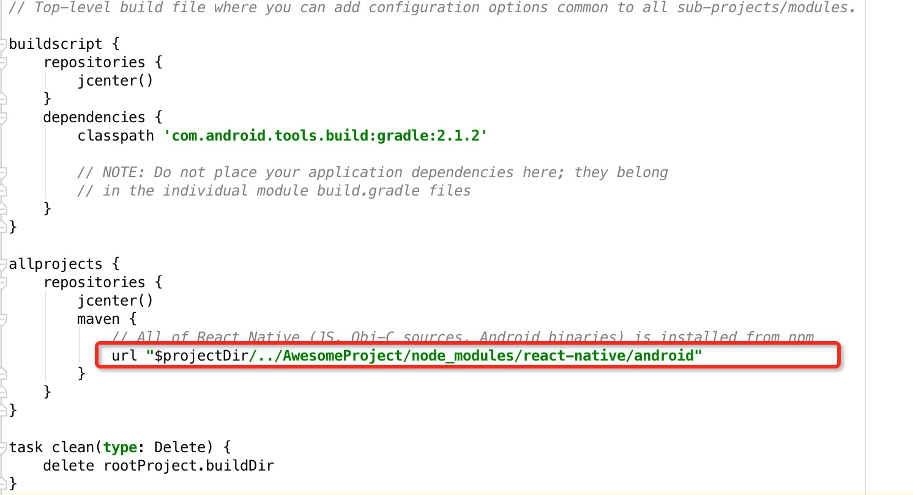
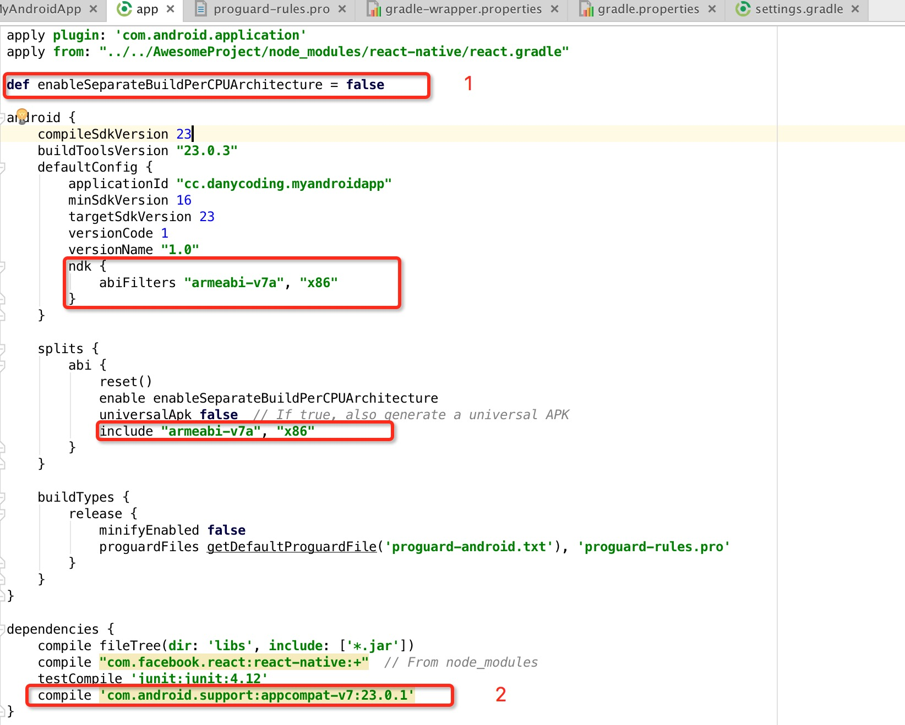
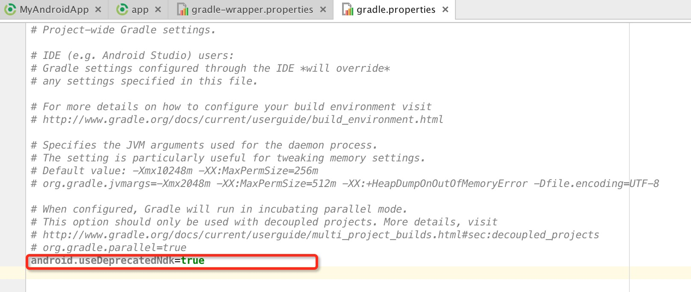
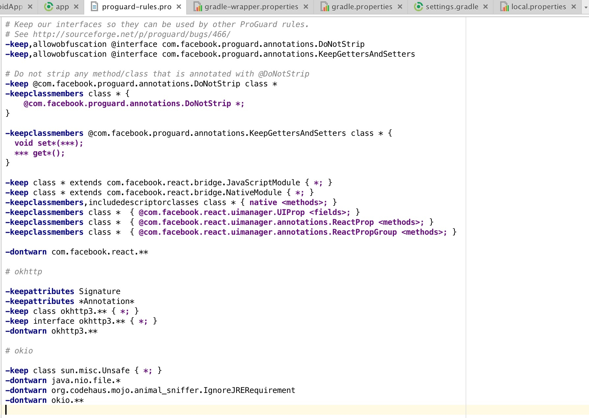

# 8.2 Android

At first I followed the official instruction (which seems very simple) but lots of build or runtime
error occurs 😂.

Such as:

``` Can't find variable: __fbBatchedBridge (<unknown file>:1)```

```java.lang.UnsatisfiedLinkError: could find DSO to load: libreactnativejni.so```

```android.view.WindowManager$BadTokenException: Unable to add window android.view.ViewRootImpl$W@5d992cf -- permission denied for this window type```

But the demo works corrcetly, so I decided to copy the build settings of it. And finally it works normally on my Nexus 5X. Steps:

- Add the path to the root gradle file,


- Modify the app gradle file,


    *1. Official demo use this variable to control wheather building different app of cpu, that will reduce the size of each app, I just ignore it here.

    *2. The version support package matters..
As react-native Android use many open source projects, if you use some of them already, you should check the version or exclude the from dependencies.  [The list currently](https://github.com/facebook/react-native/blob/master/ReactAndroid/build.gradle) 

    ```
    compile 'com.android.support:appcompat-v7:23.0.1'
    compile 'com.android.support:recyclerview-v7:23.0.1'
    compile 'com.facebook.fresco:fresco:0.11.0'
    compile 'com.facebook.fresco:imagepipeline-okhttp3:0.11.0'
    compile 'com.fasterxml.jackson.core:jackson-core:2.2.3'
    compile 'com.google.code.findbugs:jsr305:3.0.0'
    compile 'com.squareup.okhttp3:okhttp:3.2.0'
    compile 'com.squareup.okhttp3:okhttp-urlconnection:3.2.0'
    compile 'com.squareup.okhttp3:okhttp-ws:3.2.0'
    compile 'com.squareup.okio:okio:1.8.0'
    compile 'org.webkit:android-jsc:r174650'
```
- Modify root gradle.properties,


- Add proguard rules,

